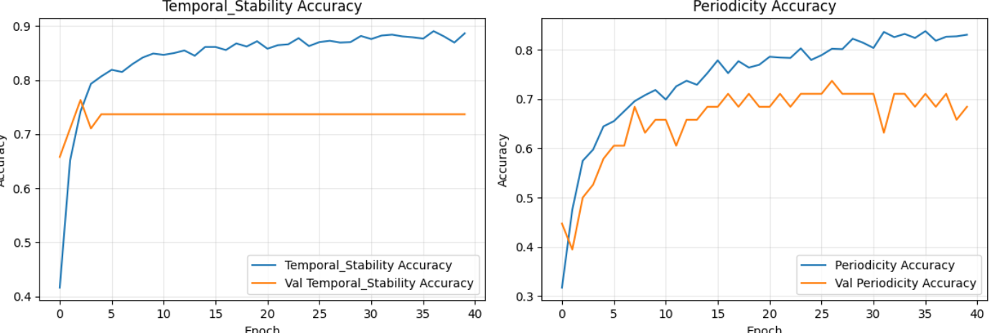

# NO RULE BASED

## All 3 concepts

### CNN Results

```txt
Evaluating model...

=== RESULTS ===

--- Classification Concepts (Discrete) ---
Periodicity - Accuracy: 0.6316, AUROC: 0.8172
Temporal Stability - Accuracy: 0.7632, AUROC: 0.8819
Coordination - Accuracy: 0.7105, AUROC: 0.8785

--- Overall Performance ---
Overall Average Accuracy (classification concepts): 70.2%
Overall Average AUROC (classification concepts): 0.8592
```

### Logistic Regression

```txt
=== Logistic Regression (trained on GT concepts from TRAIN split) ===
Accuracy: 0.3684210526315789
AUROC: 0.8474282354070661
              precision    recall  f1-score   support

           0       0.00      0.00      0.00         6
           1       0.25      0.29      0.27         7
           2       0.67      1.00      0.80         6
           3       0.43      0.50      0.46         6
           4       0.38      0.50      0.43         6
           5       0.00      0.00      0.00         7

    accuracy                           0.37        38
   macro avg       0.29      0.38      0.33        38
weighted avg       0.28      0.37      0.32        38

[[0 0 0 2 3 1]
 [0 2 0 1 1 3]
 [0 0 6 0 0 0]
 [0 0 3 3 0 0]
 [0 0 0 1 3 2]
 [0 6 0 0 1 0]]
```

### Full CBM Results

```txt
=== CNN Results ===

Classification Concepts (Discrete)
Periodicity - Accuracy: 0.6053, AUROC: 0.7906
Temporal Stability - Accuracy: 0.7368, AUROC: 0.8663
Coordination - Accuracy: 0.7105, AUROC: 0.8377

Overall Performance
Overall Average Accuracy (classification concepts): 68.4%
Overall Average AUROC (classification concepts): 0.8316

=== LOGISTIC REGRESSION ===

LR performance (ground truth concepts to activity labels)
Accuracy: 0.3684210526315789
AUROC: 0.8474282354070661

=== FULL CBM STATS x,y,z -> concepts -> activity label ===
Accuracy: 0.5
AUROC: 0.8324172747055812
```

## 2 concepts, periodicity + temporal stability

### CNN Results

```txt
Evaluating model...

=== RESULTS ===

--- Classification Concepts (Discrete) ---
Periodicity - Accuracy: 0.7105, AUROC: 0.8433
Temporal Stability - Accuracy: 0.7368, AUROC: 0.8820

--- Overall Performance ---
Overall Average Accuracy (classification concepts): 72.4%
Overall Average AUROC (classification concepts): 0.8627
```



### Logistic Regression

```txt
=== Logistic Regression (trained on GT concepts from TRAIN split) ===
Accuracy: 0.3684210526315789
AUROC: 0.8458601350486431
              precision    recall  f1-score   support

           0       0.00      0.00      0.00         6
           1       0.33      0.29      0.31         7
           2       0.67      1.00      0.80         6
           3       0.00      0.00      0.00         6
           4       0.29      0.67      0.40         6
           5       0.25      0.29      0.27         7

    accuracy                           0.37        38
   macro avg       0.26      0.37      0.30        38
weighted avg       0.26      0.37      0.30        38

[[0 0 0 0 5 1]
 [0 2 0 1 1 3]
 [0 0 6 0 0 0]
 [0 0 3 0 3 0]
 [0 0 0 0 4 2]
 [0 4 0 0 1 2]]
```

### Full CBM Results

```txt
=== CNN Results ===

Classification Concepts (Discrete)
Periodicity - Accuracy: 0.7105, AUROC: 0.8426
Temporal Stability - Accuracy: 0.7368, AUROC: 0.9196

Overall Performance
Overall Average Accuracy (classification concepts): 72.4%
Overall Average AUROC (classification concepts): 0.8811

=== LOGISTIC REGRESSION ===

LR performance (ground truth concepts to activity labels)
Accuracy: 0.3684210526315789
AUROC: 0.8458601350486431

=== FULL CBM STATS x,y,z -> concepts -> activity label ===
Accuracy: 0.3684210526315789
AUROC: 0.7841381848438299
```

## 2 concepts, periodicity + coordination

### CNN Results

```txt
Evaluating model...

=== RESULTS ===

--- Classification Concepts (Discrete) ---
Periodicity - Accuracy: 0.7105, AUROC: 0.8280
Coordination - Accuracy: 0.7895, AUROC: 0.8607

--- Overall Performance ---
Overall Average Accuracy (classification concepts): 75.0%
Overall Average AUROC (classification concepts): 0.8444
```


### Logistic Regression

```txt
=== Logistic Regression (trained on GT concepts from TRAIN split) ===
Accuracy: 0.2894736842105263
AUROC: 0.8040574596774194
              precision    recall  f1-score   support

           0       0.00      0.00      0.00         6
           1       0.33      0.29      0.31         7
           2       0.00      0.00      0.00         6
           3       0.33      1.00      0.50         6
           4       0.38      0.50      0.43         6
           5       0.00      0.00      0.00         7

    accuracy                           0.29        38
   macro avg       0.17      0.30      0.21        38
weighted avg       0.17      0.29      0.20        38

[[0 0 0 2 3 1]
 [0 2 0 1 1 3]
 [0 0 0 6 0 0]
 [0 0 0 6 0 0]
 [0 0 0 1 3 2]
 [0 4 0 2 1 0]]
```

### Full CBM Results

```txt
=== CNN Results ===

Classification Concepts (Discrete)
Periodicity - Accuracy: 0.6842, AUROC: 0.8141
Coordination - Accuracy: 0.7368, AUROC: 0.8624

Overall Performance
Overall Average Accuracy (classification concepts): 71.1%
Overall Average AUROC (classification concepts): 0.8383

=== LOGISTIC REGRESSION ===

LR performance (ground truth concepts to activity labels)
Accuracy: 0.2894736842105263
AUROC: 0.8040574596774194

=== FULL CBM STATS x,y,z -> concepts -> activity label ===
Accuracy: 0.3684210526315789
AUROC: 0.7715033762160779
```

## 2 concepts, temporal stability + coordination

### CNN Results

```txt
Evaluating model...

=== RESULTS ===

--- Classification Concepts (Discrete) ---
Temporal Stability - Accuracy: 0.7632, AUROC: 0.8970
Coordination - Accuracy: 0.7105, AUROC: 0.8602

--- Overall Performance ---
Overall Average Accuracy (classification concepts): 73.7%
Overall Average AUROC (classification concepts): 0.8786
```


### Logistic Regression

```txt
=== Logistic Regression (trained on GT concepts from TRAIN split) ===
Accuracy: 0.34210526315789475
AUROC: 0.7528621831797236
              precision    recall  f1-score   support

           0       0.00      0.00      0.00         6
           1       0.20      0.29      0.24         7
           2       0.00      0.00      0.00         6
           3       0.30      0.50      0.38         6
           4       0.60      0.50      0.55         6
           5       0.38      0.71      0.50         7

    accuracy                           0.34        38
   macro avg       0.25      0.33      0.28        38
weighted avg       0.25      0.34      0.28        38

[[0 2 0 0 2 2]
 [0 2 0 1 0 4]
 [0 0 0 6 0 0]
 [0 3 0 3 0 0]
 [0 1 0 0 3 2]
 [0 2 0 0 0 5]]
```

### Full CBM Results

```txt
=== CNN Results ===

Classification Concepts (Discrete)
Temporal Stability - Accuracy: 0.7368, AUROC: 0.8965
Coordination - Accuracy: 0.6842, AUROC: 0.8206

Overall Performance
Overall Average Accuracy (classification concepts): 71.1%
Overall Average AUROC (classification concepts): 0.8586

=== LOGISTIC REGRESSION ===

LR performance (ground truth concepts to activity labels)
Accuracy: 0.34210526315789475
AUROC: 0.7528621831797236

=== FULL CBM STATS x,y,z -> concepts -> activity label ===
Accuracy: 0.2631578947368421
AUROC: 0.741159434203789
```

## 1 concept, periodicity

### CNN Results

```txt
Evaluating model...

=== RESULTS ===

--- Classification Concepts (Discrete) ---
Temporal Stability - Accuracy: 0.7632, AUROC: 0.8970
Coordination - Accuracy: 0.7105, AUROC: 0.8602

--- Overall Performance ---
Overall Average Accuracy (classification concepts): 73.7%
Overall Average AUROC (classification concepts): 0.8786
```


### Logistic Regression

```txt
=== Logistic Regression (trained on GT concepts from TRAIN split) ===
Accuracy: 0.34210526315789475
AUROC: 0.7528621831797236
              precision    recall  f1-score   support

           0       0.00      0.00      0.00         6
           1       0.20      0.29      0.24         7
           2       0.00      0.00      0.00         6
           3       0.30      0.50      0.38         6
           4       0.60      0.50      0.55         6
           5       0.38      0.71      0.50         7

    accuracy                           0.34        38
   macro avg       0.25      0.33      0.28        38
weighted avg       0.25      0.34      0.28        38

[[0 2 0 0 2 2]
 [0 2 0 1 0 4]
 [0 0 0 6 0 0]
 [0 3 0 3 0 0]
 [0 1 0 0 3 2]
 [0 2 0 0 0 5]]
```

### Full CBM Results

```txt
=== CNN Results ===

Classification Concepts (Discrete)
Temporal Stability - Accuracy: 0.7368, AUROC: 0.8965
Coordination - Accuracy: 0.6842, AUROC: 0.8206

Overall Performance
Overall Average Accuracy (classification concepts): 71.1%
Overall Average AUROC (classification concepts): 0.8586

=== LOGISTIC REGRESSION ===

LR performance (ground truth concepts to activity labels)
Accuracy: 0.34210526315789475
AUROC: 0.7528621831797236

=== FULL CBM STATS x,y,z -> concepts -> activity label ===
Accuracy: 0.2631578947368421
AUROC: 0.741159434203789
```